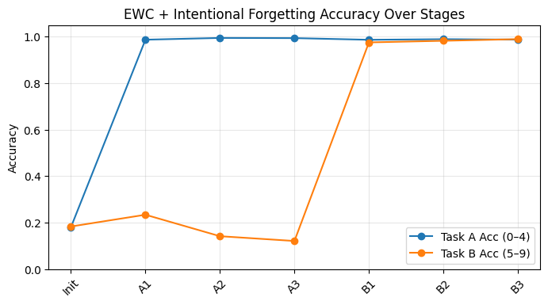
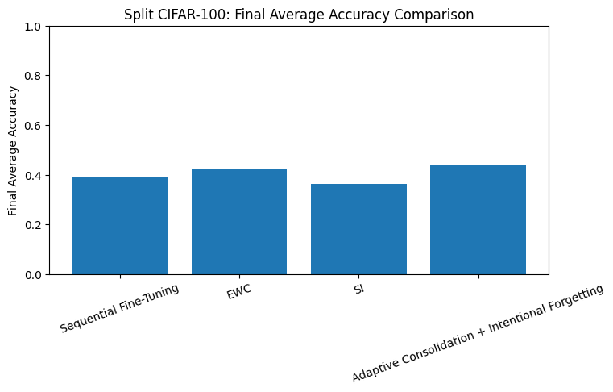
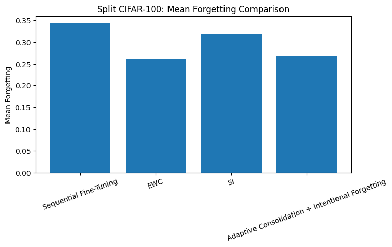
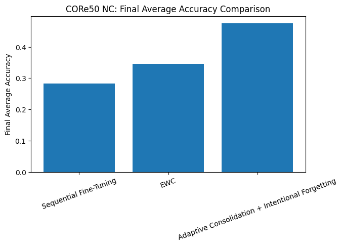
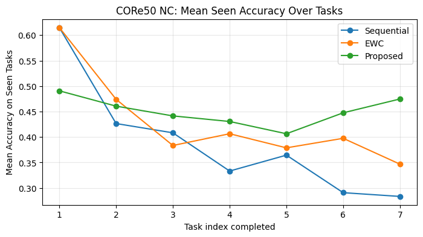
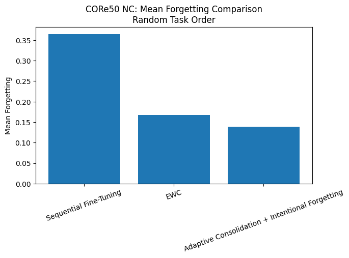

# Adaptive Consolidation with Intentional Forgetting for Task-Aware Continual Learning

A continual-learning framework that combines **Fisher-based adaptive consolidation** with **intentional forgetting** to reduce catastrophic forgetting without replay memory or architectural expansion.

This repository contains the implementation and experimental results from the **CpE 620 Final Project, Spring 2026**, evaluated on **MNIST, Split CIFAR-100, and CORe50 New Classes (NC)**.

## Overview

Continual learning systems must acquire new knowledge while retaining previously learned information. Standard sequential training often suffers from **catastrophic forgetting**, where performance on earlier tasks deteriorates as new tasks are learned.

This project investigates a task-aware continual-learning strategy with two complementary mechanisms:

- **Adaptive consolidation** protects parameters that are important to previously learned tasks using Fisher-information-weighted regularization.
- **Intentional forgetting** selectively decays parameters with low estimated importance, allowing less useful information to be released before learning a new task.

The approach does not require storing previous training examples or expanding the network architecture as new tasks arrive.

## Method

After completing a task, the diagonal Fisher information is estimated for the shared model parameters. During subsequent training, important parameters are protected using an EWC-style consolidation penalty:

```text
L_total = L_new + λ Σ_i F_i (θ_i - θ_i*)²
```

where `F_i` represents parameter importance estimated from the previous task.

Before training the next task, parameters falling within the lowest `p` percentile of Fisher importance are intentionally decayed:

```text
θ_i ← θ_i (1 - η)
```

This creates a stability-plasticity mechanism in which highly important parameters are preserved while low-importance parameters are allowed greater flexibility.

## Experimental Evaluation

The framework was evaluated progressively across three benchmarks:

| Benchmark | Setup | Purpose |
|---|---|---|
| MNIST | Digits 0–4 → 5–9 | Proof of concept |
| Split CIFAR-100 | 5 tasks × 10 classes | Multi-task benchmark |
| CORe50 NC | 7-task subset | Continual object-recognition evaluation |

The experiments compare the proposed method against **Sequential Fine-Tuning**, **Elastic Weight Consolidation (EWC)**, and, for the CIFAR-100 benchmark, **Synaptic Intelligence (SI)**.

## Results

### MNIST Proof of Concept

Sequential training produced a forgetting score of **0.0084**, while the proposed approach reduced it to **0.0064**, corresponding to approximately a **24% relative reduction** in forgetting.



### Split CIFAR-100

| Method | Final Average Accuracy | Mean Forgetting |
|---|---:|---:|
| Sequential | 0.3874 | 0.3424 |
| SI | 0.3636 | 0.3196 |
| EWC | 0.4240 | **0.2604** |
| **Proposed** | **0.4366** | 0.2670 |

The proposed method achieved the highest final average accuracy, while EWC achieved slightly lower mean forgetting.





### CORe50 New Classes

| Method | Final Average Accuracy | Mean Forgetting |
|---|---:|---:|
| Sequential | 0.2833 | 0.3615 |
| EWC | 0.3467 | 0.2919 |
| **Proposed** | **0.4747** | **0.1240** |

On the default CORe50 task sequence, the proposed approach substantially improved final average accuracy while reducing mean forgetting.





### CORe50 Task-Reordering Test

A second CORe50 experiment used the fixed task order:

```text
2 → 0 → 6 → 4 → 1 → 3 → 5
```

| Method | Final Average Accuracy | Mean Forgetting |
|---|---:|---:|
| Sequential | 0.2918 | 0.3641 |
| EWC | 0.4080 | 0.1672 |
| **Proposed** | **0.4081** | **0.1392** |

The reordered experiment was used to examine sensitivity to task ordering.



## Repository Structure

```text
Adaptive-Consolidation-Intentional-Forgetting/
├── README.md
├── notebooks/
│   ├── README.md
│   ├── 01_MNIST_Proof_of_Concept.ipynb
│   ├── 02_CIFAR100_Benchmark.ipynb
│   ├── 03_CORe50_NC_Experiment.ipynb
│   └── 04_CORe50_Task_Reordering.ipynb
└── results/
    ├── README.md
    ├── mnist_proposed_accuracy_trajectory.png
    ├── cifar100_final_average_accuracy.png
    ├── cifar100_mean_forgetting.png
    ├── core50_final_average_accuracy.png
    ├── core50_mean_seen_accuracy_trajectory.png
    └── core50_reordered_mean_forgetting.png
```

## Implementation Notes

- The experiments use a shared CNN backbone with task-specific classification heads.
- Task identity is assumed to be known during training and evaluation.
- Fisher information is used to estimate parameter importance.
- No replay buffer is required.
- The network does not expand as additional tasks are introduced.
- CORe50 experiments use a seven-task subset of the New Classes scenario.
- The notebooks retain the saved experimental outputs from the original Spring 2026 project.

## Limitations

The experiments are **task-aware**, meaning that task identity is available when selecting the appropriate classification head. The results should therefore be interpreted as an investigation of intentional forgetting as an augmentation to EWC-style consolidation rather than as a claim of state-of-the-art continual-learning performance.

Future extensions could investigate task-agnostic or class-incremental settings, longer task sequences, deeper architectures such as ResNet or Vision Transformers, and adaptive selection of the consolidation and forgetting hyperparameters.


## Status

**Completed — Spring 2026**

This repository preserves the original experimental methodology and reported results while organizing the implementation for reproducibility and portfolio presentation.
